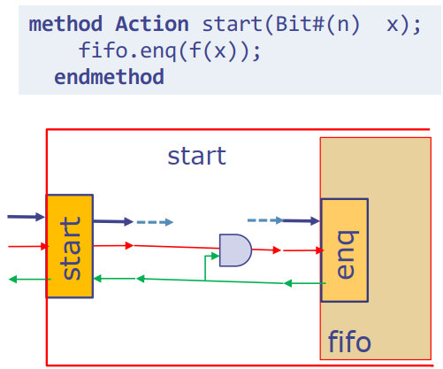

# Blue-Wrapper

# Intro

This repo provides some wrapper modules in BSV that are used to generate ready-to-use Verilog interface to facilitate interactions between BSV and other Verilog designs. The interactions among BSV modules are based on **method**. Specifically, the **Action** method is used to deliver signals into modules, and the **ActionValue** method is used to generate output signals.

<div align=center></div>

The figure above shows an interface definition in BSV and its corresponding hardware diagram. Besides data signals defined explicitly as arguments or returned type, each method definition is accompanied with two control signals implicitly, i.e., **en** and **rdy**. The **rdy** signal indicates that the method is ready to be called and **en** is set when external modules call the method. The **en-rdy** control signal pair is similar with **valid-ready** signal pair defined in the AXI protocol, which guarantees that the transaction happens only when both parties are ready. But there are still some differences between these two pairs. The most distinct one is that in BSV **en** can’t be set until **rdy** is true, which is not imposed on **valid-ready** signal pair. This dependence relationship between **en-rdy** corresponds to the hardware logic shown below, in which **en** is masked **by** rdy using AND gate.

<div align=center></div>

Due to the dependence between **rdy** and **en**, it’s error-prone to interact Verilog codes generated from BSV with other hand-written Verilog modules which may not abide this dependence. In other words, we need an extra wrapper module which implements the same hardware logic as the figure above. 

Except for dealing with the dependence relationship mentioned above, the wrapper module may also need to parse signals if they are encapsulated into a **struct** in ****BSV**.** For example, if we want to wrap our BSV module with standard Axi-Stream interface, we can define a struct as follows first:

```verilog
typedef struct {
    Bit#(TMul#(keepWidth, 8)) tData;
    Bit#(keepWidth) tKeep;
    Bit#(usrWidth) tUser;
    Bool tLast;
} AxiStream#(numeric type keepWidth, numeric type usrWidth) deriving(Bits);
```

And then the **interface** for the module is defined as follows:

```verilog
interface AxiStreamExample;
    interface Put#(AxiStream#(8, 1)) axiStreamSlave;
    interface Get#(AxiStream#(8, 1)) axiStreamMaster;
endinterface
```

The Verilog interface generated from BSV codes above is as follows, in which all fields defined in the **AxiStream** struct are packed into one signal, i.e. **axiStreamSlave_put** and **axiStreamMaster_get**.

```verilog
module mkAxiStreamExample( 
CLK,
RST_N,

axiStreamSlave_put,
EN_axiStreamSlave_put,
RDY_axiStreamSlave_put,

EN_axiStreamMaster_get,
axiStreamMaster_get, 
RDY_axiStreamMaster_get
);
```

An extra Verilog module is needed to wrap the generated module above if we want to interact it with other Verilog designs. The module mainly accomplish two things: 1) parse each field from the packed signal and 2) convert en-rdy to valid-ready.

```verilog
module mkAxiStreamExampleWrapper(
    input clk,
    input reset_n,
    
    input  s_axis_tvalid,
    output s_axis_tready,
    input  s_axis_tlast,
    input  s_axis_tuser,
    input [63:0] s_axis_tdata,
    input [ 7:0] s_axis_tkeep,
    
    output m_axis_tvalid,
    input  m_axis_tready,
    output m_axis_tlast,
    output m_axis_tuser,
    output [63:0] m_axis_tdata,
		output [ 7:0] m_axis_tkeep,
);

mkAxiStreamExample axiStreamExampleInst(
		.CLK   (    clk),
    .RST_N (reset_n),

    .EN_axiStreamSlave_put (s_axis_tvalid & s_axis_tready),
    .RDY_axiStreamSlave_put (s_axis_tready),
    .axiStreamIn_put (
				{
						s_axis_tdata,
            s_axis_tkeep,
            s_axis_tuser,
            s_axis_tlast
				}
     ),

    .EN_axiStreamMaster_get  (m_axis_tvalid & m_axis_tready),
    .RDY_axiStreamMaster_get (m_axis_tvalid),
    .axiStreamMaster_get (
				{
						m_axis_tdata,
            m_axis_tkeep,
            m_axis_tuser,
            m_axis_tlast
				}
     )
 );
endmodule
```

Although the wrapper module above works, it has some drawbacks which reduce the maintainability of the project. The way to parse the packed signal is related with the definition of the struct and if the content of struct is changed, the wrapper module also needs to change correspondingly. And it's also error-prone to handle interaction between **en-rdy** signals and **valid-ready** signals manually. What this repo does is exactly to implement this Verilog wrapper in BSV so that codes generated from BSV can interact with other hand-written Verilog modules directly.

# Methodology

## Import valid-ready pair into BSV

To implement the wrapper module, we first need to define valid and ready signals explicitly so that they can be manipulated in BSV. There are always two parties in the **valid-ready** based transactions, one is called master and the other one is called slave. The master drive the valid signal and data to slave and the slave drives the ready signal back to master to indicate that it’s ready to receive. A transaction is completed successfully only when both valid and ready are true. Interfaces defined below are used to generate valid-ready based Verilog interface and we can manipulate valid and ready signals by defining corresponding methods.

```verilog
(* always_ready, always_enabled *)
interface RawBusMaster#(type dType);
    (* result = "data" *) method dType  data;
    (* result = "valid"*) method Bool   valid;
    (* prefix = "" *) method Action ready((* port = "ready" *) Bool rdy);
endinterface

(* always_ready, always_enabled *)
interface RawBusSlave#(type dType);
    (* prefix = "" *) method Action validData(
        (* port = "valid"   *) Bool valid,
        (* port = "data"    *) dType data
    );
    (* result = "ready" *) method Bool ready;
endinterface
```

 The compiler attributes, “always_ready” and “always_enabled”, eliminate implicit en-rdy signal pair for each method. And we can specify the name of each signal in the generated Verilog by setting “result” attribute of output methods and “port” attribute of each input arguments. 

## Conversion between valid-ready and en-rdy

 In BSV,  the master corresponds to **Get** interface and the slave corresponds to **Put** interface. Besides, we also define **PipeOut** and **PipeIn** for master and slave respectively in this repo. These two interfaces are exactly defined by halving the **FIFOF** interface. Compared to **Get** and **Put**, **PipeIn** and **PipeOut** are ****more convenient to implement this conversion because we can access **rdy** signals of **enq** and **deq** methods ****through **notFull** and **notEmpty**. The declaration of **PipeIn** and **PipeOut** are as follows:

```verilog
interface PipeIn#(type dType);
    method Action enq(dType data);
    method Bool   notFull();
endinterface

interface PipeOut#(type dType);
    method dType  first();
    method Action deq();
    method Bool   notEmpty();
endinterface
```

Specifically, the conversion between **en-rdy** and **valid-ready** can be implemented in two different ways. One way is to implement **RawBusMaster** interface by invoking methods of **PipeOut** and implement **RawBusSlave** by invoking **PipeIn**. Take master for example, a module named **mkPipeOutToRawBusMaster** is defined to complete the conversion. The module takes **PipeOut** interface which is guarded by en-rdy as an argument and returns **RawBusMaster** interface which generates valid-ready based Verilog interface. Because the method invocation in BSV abides the relationship between **en** and **rdy**, so we don’t have to do anything else to guarantee that **en** only be set when **rdy** is true.

```verilog
module mkPipeOutToRawBusMaster#(PipeOut#(dType) pipe)(RawBusMaster#(dType)) provisos(Bits#(dType, dSz));
    RWire#(dType) dataW <- mkRWire;
    Wire#(Bool) readyW <- mkBypassWire;

    rule passWire if (pipe.notEmpty);
        dataW.wset(pipe.first);
    endrule

    rule passReady if (readyW);
        pipe.deq;
    endrule

    method Bool valid = pipe.notEmpty;
    method dType data = fromMaybe(?, dataW.wget);
    method Action ready(Bool rdy);
        readyW <= rdy;
    endmethod
endmodule
```

For slave, we can also implement the conversion using the same way in **mkPipeInToSlave** module. 

Another way to implement conversion between **en-rdy** and **valid-ready** is to wrap **RawBusMaster** with **PipeIn** interface and **RawBusSlave** with **PipeOut** interface. And then for other BSV modules, thay can invoke the **enq** of **PipeIn** to ****send data out and invoke **deq** and **first** of **PipeOut** to fetch data in. Taking master for example, the conversion can be implemented as follows. First, we define **RawBusMasterToPipeIn** interface which contains a **RawBusMaster** interface that generates valid-ready based Verilog interface and **PipeIn** interface which is invoked by other BSV modules to send data out through **RawBusMaster**. When implementing the **PipeIn** interface, **enq** method needs to be guarded by ready signal driven from the slave.

```verilog
interface RawBusMasterToPipeIn#(type dType);
    interface RawBusMaster#(dType) rawBus;
    interface PipeIn#(dType) pipe;
endinterface

module mkRawBusMasterToPipeIn(RawBusMasterToPipeIn#(dType)) provisos(Bits#(dType, dSz));
    RWire#(dType) validData <- mkRWire;
    Wire#(Bool) readyW <- mkBypassWire;

    interface RawBusMaster rawBus;
        method Bool valid = isValid(validData.wget);
        method dType data = fromMaybe(?, validData.wget);
        method Action ready(Bool rdy);
            readyW <= rdy;
        endmethod
    endinterface

    interface PipeIn pipe;
        method Bool notFull = readyW;
        method Action enq(dType data) if (readyW);
            validData.wset(data);
        endmethod
    endinterface
endmodule
```

## DeadLock Consideration

To avoid the deadlock between master and slave, it’s stated that the master can’t wait until ready is asserted before asserting valid in the document of AXI protocol. But it’ allowed that the slave can wait until valid is asserted before asserting ready. 

When wrapping the **RawBusMaster** with **PipeIn** interface, we have to guard the **enq** method with the ready signal from slave. This implementation implies that valid can’t be set until ready is true, which is not allowed in the AXI protocol. So when using **mkRawBusMasterToPipeIn** module, to avoid deadlock, it should be guaranteed that the slaver don’t wait to assert ready until valid from master rises. The same thing should be noted when using **mkRawBusMasterToPut** module provided in this repo, which wraps **RawBusMaster** with **Get** interface.

## Signal Parser

After completing bus conversion, we have interface **RawBusMaster#(type dType)** and **RawBusMaster#(type dType)** which will generate valid-ready guarded Verilog interface. However, if the **dType** is a user-defined **struct**, the generated Verilog will packed all fields of the **struct** into one signal. So we still have to parse each field of the struct into individual signals to generate a ready-to-use Verilog interface. 

In this repo, we have provided interfaces which is used to generate standard Axi-Stream, Axi4-Lite and Axi4 Verilog interfaces and their corresponding signal parsers. Taking Axi-Stream master for example, the raw interface definition and its parser function are as follows:

```verilog
typedef struct {
    Bit#(TMul#(keepWidth, BYTE_WIDTH)) tData;
    Bit#(keepWidth) tKeep;
    Bool tLast;
    Bit#(usrWidth) tUser;
} AxiStream#(numeric type keepWidth, numeric type usrWidth) deriving(Bits, FShow);

(*always_ready, always_enabled*)
interface RawAxiStreamMaster#(numeric type keepWidth, numeric type usrWidth);
    (* result = "tvalid" *) method Bool tValid;
    (* result = "tdata"  *) method Bit#(TMul#(keepWidth, BYTE_WIDTH)) tData;
    (* result = "tkeep"  *) method Bit#(keepWidth) tKeep;
    (* result = "tlast"  *) method Bool tLast;
    (* result = "tuser"  *) method Bit#(usrWidth) tUser;
    (* always_enabled, prefix = "" *) method Action tReady((* port="tready" *) Bool ready);
endinterface

function RawAxiStreamMaster#(keepWidth, usrWidth) convertRawBusToRawAxiStreamMaster(
    RawBusMaster#(AxiStream#(keepWidth, usrWidth)) rawBus
);
    return (
        interface RawAxiStreamMaster;
            method Bool tValid = rawBus.valid;
            method Bit#(TMul#(keepWidth, BYTE_WIDTH)) tData = rawBus.data.tData;
            method Bit#(keepWidth) tKeep = rawBus.data.tKeep;
            method Bool tLast = rawBus.data.tLast;
            method Bit#(usrWidth) tUser = rawBus.data.tUser;
            method Action tReady(Bool rdy);
                rawBus.ready(rdy);
            endmethod
        endinterface
    );
endfunction
```

# API

## SemiFifo Package

### Description

The SemiFifo package defines **PipeOut** and **PipeIn** interfaces and some other conversion functions related with them.

### Interfaces

- **PipeOut** interface ****corresponds to ****the deq side of **FIFOF:**

```verilog
interface PipeOut#(type dType);
    method dType  first();
    method Action deq();
    method Bool   notEmpty();
endinterface
```

- **PipeIn** interface corresponds to the enq side of **FIFOF**:

```verilog
interface PipeIn#(type dType);
    method Action enq(dType data);
    method Bool   notFull();
endinterface
```

### Functions

| Name | Input Type | Return Type | Description |
| --- | --- | --- | --- |
| convertFifoToPipeOut | FIFOF | PipeOut | extract methods of PipeOut from FIFOF |
| convertFifoToPipeIn | FIFOF | PipeOut | extract methods of PipeIn from FIFOF |

## BusConversion Package

### Description

This package defines interfaces which generate valid-ready based Verilog interfaces and some modules that implement the conversion between **valid-ready** and **en-rdy**.

### Interfaces

- **RawBusMaster** generates the master side Verilog interface that drives valid and data to slave and receives ready from slave.

```verilog
(* always_ready, always_enabled *)
interface RawBusMaster#(type dType);
    (* result = "data" *) method dType  data;
    (* result = "valid"*) method Bool   valid;
    (* prefix = "" *) method Action ready((* port = "ready" *) Bool rdy);
endinterface
```

- **RawBusSlave** generates the slave side Verilog interface that receives valid and data from master, and drives ready to master.

```verilog
(* always_ready, always_enabled *)
interface RawBusSlave#(type dType);
    (* prefix = "" *) method Action validData(
        (* port = "valid"   *) Bool valid,
        (* port = "data"    *) dType data
    );
    (* result = "ready" *) method Bool ready;
endinterface
```

- **RawBusMasterToPipeIn** interface consists of two sub-interfaces, including **RawBusMaster** which ****generates valid-ready Verilog interface and **PipeIn** interface which wraps **RawBusMaster** so that it can be invoked by other BSV modules.

```verilog
interface RawBusMasterToPipeIn#(type dType);
    interface RawBusMaster#(dType) rawBus;
    interface PipeIn#(dType) pipe;
endinterface
```

- **RawBusSlaveToPipeOut** interface consists of two sub-interfaces, including **RawBusSlave** which ****generates valid-ready Verilog interface and **PipeOut** interface which wraps **RawBusSlave** so that it can be invoked by other BSV modules.

```verilog
interface RawBusSlaveToPipeOut#(type dType);
    interface RawBusSlave#(dType) rawBus;
    interface PipeOut#(dType) pipe;
endinterface
```

- **RawBusMasterToPut** interface is similar to **RawBusMasterToPipeIn**, which ****replaces **PipeIn** with **Put** interface .
- **RawBusSlaveToGet** interface corresponds to **RawBusMasterToPipeOut** and  ****it replaces **PipeOut** with **Get** interface**.**

### Modules

| Name | Input Argument | Returned Interface | Description |
| --- | --- | --- | --- |
| mkPipeOutToRawBusMaster | PipeOut#(dType) | RawBusMaster#(dType) | convert PipeOut to RawBusMaster |
| mkPipeInToRawBusSlave | PipeIn#(dType) | RawBusSlave#(dType) | convert PipeIn to RawBusSlave |
| mkGetToRawBusMaster | Get#(dType) | RawBusMaster#(dType) | convert Get to RawBusMaster |
| mkPutToRawBusSlave | Put#(dType) | RawBusSlave#(dType) | convert Put to RawBusSlave |
| mkRawBusMasterToPipeIn | / | RawBusMasterToPipeIn#(dType) | wrap RawBusMaster as PipeIn |
| mkRawBusSlaveToPipeOut | / | RawBusSlaveToPipeOut#(dType) | wrap RawBusSlave as PipeOut |
| mkRawBusMasterToPut | / | RawBusMasterToPut#(dType) | wrap RawBusMaster as Put |
| mkRawBusSlaveToGet | / | RawBusSlaveToGet#(dType) | wrap RawBusSlave as Get |

## AxiStreamTypes Package

### Description

This package defines **AxiStream** struct that encapsulates signals listed in the Axi-Stream protocol and interfaces that are used to generate standard Axi-Stream Verilog interface. Besides, some parser functions are also provided to extract each field in **AxiStream** struct to individual signals.

### Structs

- AxiStream encapsulates signals defined in the standard Axi-Stream protocol. The widths of tdata and tuser signals are configurable.

```verilog
typedef struct {
    Bit#(TMul#(keepWidth, BYTE_WIDTH)) tData;
    Bit#(keepWidth) tKeep;
    Bool tLast;
    Bit#(usrWidth) tUser;
} AxiStream#(numeric type keepWidth, numeric type usrWidth) deriving(Bits, FShow);
```

### Interfaces

- **RawAxiStreamMaster** interface generates the Verilog interface of the master side in Axi-Stream protocol.
- **RawAxiStreamSlave** interface generates the Verilog interface of the slave side in Axi-Stream protocol.
- **RawAxiStreamMasterToPipeIn** interface consists of two sub-interfaces, including **RawAxiStreamMaster** and **PipeIn#(AxiStream)** used to wrap the previous one.
- **RawAxiStreamSlaveToPipeOut** interface consists of two sub-interfaces, including **RawAxiStreamSlave** and **PipeOut#(AxiStream)** used to wrap the previous one.
- RawAxiStreamMasterToPut interface is similar to Raw
- RawAxiStreamSlaveToGet

### Functions

- **convertRawBusToRawAxiStreamMaster** function takes in a parameter of RawBusMaster#(AxiStream) and return RawAxiStreamMaster interface. The main thing this function completes is to parse each field in AxiStream struct and connect to its corresponding signal in RawAxiStreamMaster interface.
- **convertRawBusToRawAxiStreamSlave** fucntion implements the same functionality as convertRawBusToRawAxiStreamMaster but it is applied on the slave side.

### Modules

| Name | Input Argument | Returned Interface | Description |
| --- | --- | --- | --- |
| mkPipeOutToRawAxiStreamMaster | PipeOut#(AxiStream) | RawAxiStreamMaster | convert PipeOut#(AxiStream) to RawAxiStreamMaster |
| mkPipeInToRawAxiStreamSlave | PipeIn#(AxiStream) | RawAxiStreamSlave | convert PipeIn#(AxiStream) to RawAxiStreamSlave |
| mkGetToRawAxiStreamMaster | Get#(AxiStream) | RawAxiStreamMaster | convert Get#(AxiStream) to RawAxiStreamMaster |
| mkPutToRawAxiStreamSlave | Put#(AxiStream) | RawAxiStreamSlave | convert Put#(AxiStream) to RawAxiStreamSlave |
| mkRawAxiStreamMasterToPipeIn | / | RawAxiStreamMasterToPipeIn | wrap RawAxiStreamMaster as PipeIn#(AxiStream) |
| mkRawAxiStreamSlaveToPipeOut | / | RawAxiStreamSlaveToPipeOut | wrap RawAxiStreamSlave as PipeOut#(AxiStream) |
| mkRawAxiStreamMasterToPut | / | RawAxiStreamMasterToPut | wrap RawAxiStreamMaster as Put#(AxiStream) |
| mkRawAxiStreamSlaveToGet | / | RawAxiStreamSlaveToGet | wrap RawAxiStreamSlave as Get#(AxiStream) |

## Axi4LiteTypes Package

### Description

This package provides **struct**s that encapsulate signals defined in Axi4-Lite protocol and **interface**s that are used to generate standard Axi4-Lite Verilog interfaces. Besides some parser functions are implemented to parse each field of **struct**s into individual signals.

### Structs

- **Axi4LiteWrAddr** struct encapsulates signals listed in the write address channel of Axi4-Lite protocol.
- **Axi4LiteWrData** struct encapsulates signals listed in the write data channel of Axi4-Lite protocol.
- **Axi4LiteRdAddr** struct encapsulates signals listed in the read address channel of Axi4-Lite protocol.
- **Axi4LiteRdData** struct encapsulates signals listed in the read data channel of Axi4-Lite protocol.

For Axi4-Lite protocol, the write response channel consists of only one signal so it’s defined as Bit#(AXI4_RESP_WIDTH) with type name **Axi4LiteWrResp.**

### Interfaces

- **RawAxi4LiteWrMaster** interface is used to generate Verilog interface containing all signals listed in the write address, write data and write response channels for the master side.
- **RawAxi4LiteRdMaster** interface is used to generate Verilog interface containing all signals listed in the read address, read data channels for the master side.
- **RawAxi4LiteWrSlave** and **RawAxi4LiteRdSlave** are similar to two interfaces but is implemented for the slave side.
- **RawAxi4LiteMaster** interface is used to generate Verilog interface containing all signals listed in Axi4-Lite interfaces and it consists of two sub-interfaces including **RawAxi4LiteWrMaster** and **RawAxi4LiteRdMaster**.
- **RawAxi4LiteSlave** interface is similar to **RawAxi4LiteMaster** but is used generate Verilog interface for the slave side.

### Functions

| Name | Description |
| --- | --- |
| parseRawBusToRawAxi4LiteWrMaster | Extract fields in the Axi4LiteWrAddr, Axi4LiteWrData and Axi4LiteWrResp structs to individual signals for the master |
| parseRawBusToRawAxi4LiteRdMaster | Extract fields in the Axi4LiteRdAddr and Axi4LiteRdData structs to individual signals for the master |
| parseRawBusToRawAxi4LiteWrSlave | Extract fields in the Axi4LiteWrAddr, Axi4LiteWrData and Axi4LiteWrResp structs to individual signals for the slave |
| parseRawBusToRawAxi4LiteWrSlave | Extract fields in the Axi4LiteRdAddr and Axi4LiteRdData structs to individual signals for the slave |

## Axi4Types Package

This package can be perceived as an augmented version of **Axi4LiteTypes** package, providing similar structs, interfaces and functions for Axi4 protocol that has more sophisticated signals than Axi4-Lite.

# Links

The implementation of this repo has referred to some other open-source codes. And their links are listed as follows:

Flute: [https://github.com/bluespec/Flute/tree/master/src_Testbench/Fabrics/AXI4_Lite](https://github.com/bluespec/Flute/tree/master/src_Testbench/Fabrics/AXI4_Lite)

Blue-AXI: [https://github.com/esa-tu-darmstadt/BlueAXI](https://github.com/esa-tu-darmstadt/BlueAXI)

bsc-contrib: [https://github.com/B-Lang-org/bsc-contrib/tree/main](https://github.com/B-Lang-org/bsc-contrib/tree/main)