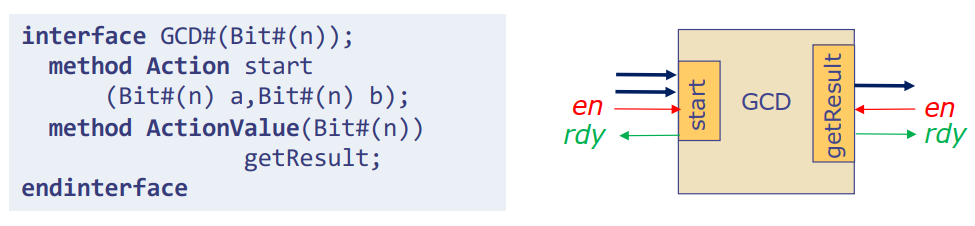

# Blue-Wrapper

## Intro
For circuit modules implemented in Bluespec SystemVerilog(BSV), they interact with each other based on **method**. Besides data signals defined explicitly as arguments or returned type, each **method** definition is accompanied with two implicit control signals, i.e., **en** and **rdy**. The **rdy** signal indicates that the method is ready to be called and **en** is set by external modules when calling the method. The figure below shows an interface definition in BSV and its corresponding hardware diagram.
<div align=center></div>

The **en-rdy** is similar with **valid-ready** signal pair commonly used in handcrafted Verilog designs. Both of these two signal pairs are designed to guarantee that the transaction happens only when both parties are ready. Although they implement the same functionality, the underlying mechanism is quite different from each other, which makes the interaction between BSV modules and other handcrafted Verilog designs very tricky and error-prone. 

Apart from the differences in control signals, the Verilog code generated by BSV also presents the following issue: if multiple related input/output signals are encapsulated within a **struct** in BSV, then in the generated Verilog interface, all encapsulated fields will be merged into a single signal. 

Here is an example illustrating the problems encountered when interacting codes generated from BSV and handcrafted Verilog designs. Suppose that we design a module with standard AXI-Stream interface in BSV and the **interface** definition for this module is as follows:

```verilog
typedef struct {
    Bit#(TMul#(keepWidth, 8)) tData;
    Bit#(keepWidth) tKeep;
    Bit#(usrWidth) tUser;
    Bool tLast;
} AxiStream#(numeric type keepWidth, numeric type usrWidth) deriving(Bits);

interface AxiStreamExample;
    interface Put#(AxiStream#(8, 1)) axiStreamSlave;
    interface Get#(AxiStream#(8, 1)) axiStreamMaster;
endinterface
```

The Verilog ports generated from the BSV **interface** above are shown below, in which all fields defined in the **AxiStream** struct are packed into one signal, i.e. **axiStreamSlave_put** and **axiStreamMaster_get**.

```verilog
module mkAxiStreamExample( 
    CLK,
    RST_N,

    axiStreamSlave_put,
    EN_axiStreamSlave_put,
    RDY_axiStreamSlave_put,

    EN_axiStreamMaster_get,
    axiStreamMaster_get, 
    RDY_axiStreamMaster_get
);
```

To interact with other handcrafted Verilog designs, an extra Verilog module is needed to wrap the **mkAxiStreamExample** and expose standard AXI-Stream interface to the outside. A commonly used implementation of this wrapper module is shown below, which mainly accomplishes two things: 1) parse each field from the packed signal and 2) convert **en-rdy** to **valid-ready**.

```verilog
module mkAxiStreamExampleWrapper(
    input clk,
    input reset_n,
    
    input  s_axis_tvalid,
    output s_axis_tready,
    input  s_axis_tlast,
    input  s_axis_tuser,
    input [63:0] s_axis_tdata,
    input [ 7:0] s_axis_tkeep,
    
    output m_axis_tvalid,
    input  m_axis_tready,
    output m_axis_tlast,
    output m_axis_tuser,
    output [63:0] m_axis_tdata,
	output [ 7:0] m_axis_tkeep,
);

mkAxiStreamExample axiStreamExampleInst(
	.CLK   (    clk),
    .RST_N (reset_n),

    .EN_axiStreamSlave_put (s_axis_tvalid & s_axis_tready),
    .RDY_axiStreamSlave_put (s_axis_tready),
    .axiStreamIn_put (
        {
			s_axis_tdata,
            s_axis_tkeep,
            s_axis_tuser,
            s_axis_tlast
		}
     ),

    .EN_axiStreamMaster_get  (m_axis_tvalid & m_axis_tready),
    .RDY_axiStreamMaster_get (m_axis_tvalid),
    .axiStreamMaster_get (
		{
			m_axis_tdata,
            m_axis_tkeep,
            m_axis_tuser,
            m_axis_tlast
		}
    )
 );
endmodule
```

Although the wrapper module above works, it has some drawbacks which reduce the maintainability of the BSV project. The way to parse the packed signal is related with the definition of the struct and if the content of struct is changed, the wrapper module also needs to change correspondingly. And it's also error-prone to handle interaction between **en-rdy** signals and **valid-ready** signals manually. What this repo does is exactly to implement this Verilog wrapper in BSV so that codes generated from wrapped BSV designs can interact with other hand-written Verilog modules directly.


# Package Reference

## SemiFifo Package

### Description

The SemiFifo package provides **PipeOut** and **PipeIn** interfaces and some utility functions related with them. The **PipeOut** and **PipeIn** interface are similiar with **Get/Put**, which are designed to output and input data respectively. However, **PipeOut/PipeIn** exposes the implicit **rdy** signal of **deq/enq** through **notEmpty/notFull** to designers, which is inaccessible for **get/put** methods in **Get/Put** interface.

### Interfaces

- **PipeOut** wraps the methods related with **deq** in **FIFOF** interface:

```verilog
interface PipeOut#(type dType);
    method dType  first();
    method Action deq();
    method Bool   notEmpty();
endinterface
```

- **PipeIn** wraps the methods related with **enq** in **FIFOF** interface:

```verilog
interface PipeIn#(type dType);
    method Action enq(dType data);
    method Bool   notFull();
endinterface
```

### Functions
SemiFifo package also provides some utility functions and modules related with **PipeIn/PipeOut** interface. Here just lists some frequently used ones and for all other functions you can find them in [src/SemiFifo.bsv](./src/SemiFifo.bsv).
| Name | Input Type | Return Type | Description |
| --- | --- | --- | --- |
| convertFifoToPipeOut | FIFOF | PipeOut | extract methods of PipeOut from FIFOF |
| convertFifoToPipeIn  | FIFOF | PipeOut | extract methods of PipeIn from FIFOF  |
| toGet | PipeOut | Get | convert PipeOut interface to Get interface |
| toPut | PipeIn  | Put | convert PipeIn interface to Put interface |

## BusConversion Package

### Description

BusConversion package defines interfaces which generate **valid-ready** based Verilog interfaces and some modules that implement the conversion between **valid-ready** and **en-rdy**.

### Interfaces

- **RawBusMaster** generates the master side Verilog interface that drives valid and data to slave and receives ready from slave.

```verilog
(* always_ready, always_enabled *)
interface RawBusMaster#(type dType);
    (* result = "data" *) method dType  data;
    (* result = "valid"*) method Bool   valid;
    (* prefix = "" *) method Action ready((* port = "ready" *) Bool rdy);
endinterface
```

- **RawBusSlave** generates the slave side Verilog interface that receives valid and data from master, and drives ready to master.

```verilog
(* always_ready, always_enabled *)
interface RawBusSlave#(type dType);
    (* prefix = "" *) method Action validData(
        (* port = "valid"   *) Bool valid,
        (* port = "data"    *) dType data
    );
    (* result = "ready" *) method Bool ready;
endinterface
```

- **RawBusMasterToPipeIn** interface consists of two sub-interfaces, including **RawBusMaster** which generates **valid-ready** based Verilog interface and **PipeIn** interface which wraps **RawBusMaster** so that it can be invoked by other BSV modules to initiate transactions.

```verilog
interface RawBusMasterToPipeIn#(type dType);
    interface RawBusMaster#(dType) rawBus;
    interface PipeIn#(dType) pipe;
endinterface
```

- **RawBusSlaveToPipeOut** interface consists of two sub-interfaces, including **RawBusSlave** which generates **valid-ready** based Verilog interface and **PipeOut** interface which wraps **RawBusSlave** so that it can be invoked by other BSV modules.

```verilog
interface RawBusSlaveToPipeOut#(type dType);
    interface RawBusSlave#(dType) rawBus;
    interface PipeOut#(dType) pipe;
endinterface
```

- **RawBusMasterToPut** interface is similar to **RawBusMasterToPipeIn**, which replaces **PipeIn** with **Put** interface .
- **RawBusSlaveToGet** interface corresponds to **RawBusMasterToPipeOut** and it replaces **PipeOut** with **Get** interface.

### Modules

| Name | Input Argument | Returned Interface | Description |
| --- | --- | --- | --- |
| mkPipeOutToRawBusMaster | PipeOut pipe | RawBusMaster | convert PipeOut to RawBusMaster |
| mkPipeInToRawBusSlave | PipeIn pipe | RawBusSlave | convert PipeIn to RawBusSlave |
| mkGetToRawBusMaster | Get get, FifoType fifoType | RawBusMaster | convert Get to RawBusMaster |
| mkPutToRawBusSlave | Put put, FifoType fifoType | RawBusSlave | convert Put to RawBusSlave |
| mkRawBusMasterToPipeIn | / | RawBusMasterToPipeIn | wrap RawBusMaster as PipeIn |
| mkRawBusSlaveToPipeOut | / | RawBusSlaveToPipeOut | wrap RawBusSlave as PipeOut |
| mkRawBusMasterToPut | / | RawBusMasterToPut | wrap RawBusMaster as Put |
| mkRawBusSlaveToGet | / | RawBusSlaveToGet | wrap RawBusSlave as Get |

Note: **mkGetToRawBusMaster** and **mkPutToRawBusSlave** modules need an input argument of **FifoType** enumeration that specifies the type of intermediate fifo used in these two modules. The valid values for **FifoType** enumeration include **CF**, **BYPASS** and **PIPELINE**, which correspond to **mkFIFOF**, **mkBypassFIFOF** and **mkPipelineFIFOF** respectively.

## AxiStreamTypes Package

### Description

This package defines **AxiStream** struct that encapsulates signals listed in the AXI-Stream protocol and interfaces that are used to generate standard AXI-Stream Verilog interface. Besides, some parser functions are also provided to extract each field in **AxiStream** struct to individual signals.

### Structs

- **AxiStream** encapsulates signals defined in the standard Axi-Stream protocol. The widths of tkeep and tuser signals are configurable.

```verilog
typedef struct {
    Bit#(TMul#(keepWidth, BYTE_WIDTH)) tData;
    Bit#(keepWidth) tKeep;
    Bool tLast;
    Bit#(usrWidth) tUser;
} AxiStream#(numeric type keepWidth, numeric type usrWidth) deriving(Bits, FShow);
```

### Interfaces

- **RawAxiStreamMaster** interface generates the standard AXI-Stream Verilog interface for master.
- **RawAxiStreamSlave** interface generates the standard AXI-Stream Verilog interface for slave.
- **RawAxiStreamMasterToPipeIn** interface consists of two sub-interfaces, including **RawAxiStreamMaster** and **PipeIn#(AxiStream)** used to wrap the other one.
- **RawAxiStreamSlaveToPipeOut** interface consists of two sub-interfaces, including **RawAxiStreamSlave** and **PipeOut#(AxiStream)** used to wrap the other one.
- **RawAxiStreamMasterToPut** replaces **PipeIn** in **RawAxiStreamMasterToPipeIn** with **Put**.
- **RawAxiStreamSlaveToGet** replcaes **PipeOut** in **RawAxiStreamSlaveToPipeOut** with **Get**.

All interfaces listed above are configurable with respect to the width of tkeep and tusr signals in AXI-Stream bus.
### Functions

- **convertRawBusToRawAxiStreamMaster** function takes in a parameter of RawBusMaster#(AxiStream) and return RawAxiStreamMaster interface. The main task this function accomplishes is to parse each field in **AxiStream** struct and connect to its corresponding signal in **RawAxiStreamMaster** interface.
- **convertRawBusToRawAxiStreamSlave** fucntion implements the same functionality as **convertRawBusToRawAxiStreamMaster** but it is applied on the slave side.

### Modules

| Name | Input Argument | Returned Interface | Description |
| --- | --- | --- | --- |
| mkPipeOutToRawAxiStreamMaster | PipeOut#(AxiStream) pipe | RawAxiStreamMaster | convert PipeOut#(AxiStream) to RawAxiStreamMaster |
| mkPipeInToRawAxiStreamSlave | PipeIn#(AxiStream) pipe | RawAxiStreamSlave | convert PipeIn#(AxiStream) to RawAxiStreamSlave |
| mkGetToRawAxiStreamMaster | Get#(AxiStream) get, FifoType fifoType | RawAxiStreamMaster | convert Get#(AxiStream) to RawAxiStreamMaster |
| mkPutToRawAxiStreamSlave | Put#(AxiStream) put, FifoType fifoType | RawAxiStreamSlave | convert Put#(AxiStream) to RawAxiStreamSlave |
| mkRawAxiStreamMasterToPipeIn | / | RawAxiStreamMasterToPipeIn | wrap RawAxiStreamMaster as PipeIn#(AxiStream) |
| mkRawAxiStreamSlaveToPipeOut | / | RawAxiStreamSlaveToPipeOut | wrap RawAxiStreamSlave as PipeOut#(AxiStream) |
| mkRawAxiStreamMasterToPut | / | RawAxiStreamMasterToPut | wrap RawAxiStreamMaster as Put#(AxiStream) |
| mkRawAxiStreamSlaveToGet | / | RawAxiStreamSlaveToGet | wrap RawAxiStreamSlave as Get#(AxiStream) |

## Axi4LiteTypes Package

### Description

This package provides **struct**s that encapsulate signals defined in Axi4-Lite protocol and **interface**s that are used to generate standard Axi4-Lite Verilog interfaces. Besides some parser functions are implemented to parse each field of **struct**s into individual signals.

### Structs

- **Axi4LiteWrAddr** struct encapsulates signals listed in the write address channel of Axi4-Lite protocol.
- **Axi4LiteWrData** struct encapsulates signals listed in the write data channel of Axi4-Lite protocol.
- **Axi4LiteRdAddr** struct encapsulates signals listed in the read address channel of Axi4-Lite protocol.
- **Axi4LiteRdData** struct encapsulates signals listed in the read data channel of Axi4-Lite protocol.

For Axi4-Lite protocol, the write response channel consists of only one signal so it’s defined as Bit#(AXI4_RESP_WIDTH) with type name **Axi4LiteWrResp.**

### Interfaces

- **RawAxi4LiteWrMaster** interface is used to generate Verilog interface containing all signals listed in the write address, write data and write response channels for the master side.
- **RawAxi4LiteRdMaster** interface is used to generate Verilog interface containing all signals listed in the read address, read data channels for the master side.
- **RawAxi4LiteWrSlave** and **RawAxi4LiteRdSlave** are similar to two interfaces but is implemented for the slave side.
- **RawAxi4LiteMaster** interface is used to generate Verilog interface containing all signals listed in Axi4-Lite interfaces and it consists of two sub-interfaces including **RawAxi4LiteWrMaster** and **RawAxi4LiteRdMaster**.
- **RawAxi4LiteSlave** interface is similar to **RawAxi4LiteMaster** but is used generate Verilog interface for the slave side.

### Functions

| Name | Description |
| --- | --- |
| parseRawBusToRawAxi4LiteWrMaster | Extract fields in the Axi4LiteWrAddr, Axi4LiteWrData and Axi4LiteWrResp structs to individual signals for the master |
| parseRawBusToRawAxi4LiteRdMaster | Extract fields in the Axi4LiteRdAddr and Axi4LiteRdData structs to individual signals for the master |
| parseRawBusToRawAxi4LiteWrSlave | Extract fields in the Axi4LiteWrAddr, Axi4LiteWrData and Axi4LiteWrResp structs to individual signals for the slave |
| parseRawBusToRawAxi4LiteWrSlave | Extract fields in the Axi4LiteRdAddr and Axi4LiteRdData structs to individual signals for the slave |

## Axi4Types Package

This package can be perceived as an augmented version of **Axi4LiteTypes** package, providing similar structs, interfaces and functions for Axi4 protocol that has more sophisticated signals than Axi4-Lite.

# Get Started
This section introduces detailed steps of how to wrap BSV modules to generate ready-to-use Verilog interfaces using blue-wrapper. Here we take the **AxiStreamExample** shown in the very beginning as an example:
```verilog
interface AxiStreamExample;
    interface Put#(AxiStream#(8, 1)) axiStreamSlave;
    interface Get#(AxiStream#(8, 1)) axiStreamMaster;
endinterface

module mkAxiStreamExample(AxiStreamExample);
    ...
    ...
endmodule
```

1. Clone this repo to $(BLUE_WRAPPER_DIR):
```bash
git clone https://github.com/wengwz/blue-wrapper $(BLUE_WRAPPER_DIR)
```
2. Import used packages:
```verilog
import BusConversion :: *;
import AxiStreamTypes :: *;
```
3. Defines the top **interface** which generates ready-to-use Verilog modules using **RawAxiStreamMaster** and **RawAxiStreamSlave** as subinterfaces:
```verilog
interface RawAxiStreamExample;
    interface RawAxiStreamMaster#(8, 1) rawAxiStreamMaster;
    interface RawAxiStreamSlave#(8, 1) rawAxiStreamSlave;
endinterface
```
4. Implement **mkRawAxiStreamExample** module to convert **Get/Put** to **RawAxiStreamMaster/RawAxiStreamSlave**:
```verilog
module mkRawAxiStreamExample(RawAxiStreamExample);
    AxiStreamExample axiExample <- mkAxiStreamExample;
    let rawMaster <- mkGetToRawAxiStreamMaster(axiExample.axiStreamMaster, CF);
    let rawSlave <- mkPutToRawAxiStreamSlave(axiExample.axiStreamSlave, CF);

    interface rawAxiStreamMaster = rawMaster;
    interface rawAxiStreamSlave = rawSlave;
endmodule
```

5. When compiling BSV codes using blue-wrapper, add the path **$(BLUE_WRAPPER_DIR)/src** to original compile options.
```bash
bsc -p +:$(BLUE_WRAPPER_DIR)/src ...
```

# Related Links

The implementation of this repo has referred to some other open-source codes. And their links are listed as follows:

Flute: [https://github.com/bluespec/Flute/tree/master/src_Testbench/Fabrics/AXI4_Lite](https://github.com/bluespec/Flute/tree/master/src_Testbench/Fabrics/AXI4_Lite)

Blue-AXI: [https://github.com/esa-tu-darmstadt/BlueAXI](https://github.com/esa-tu-darmstadt/BlueAXI)

bsc-contrib: [https://github.com/B-Lang-org/bsc-contrib/tree/main](https://github.com/B-Lang-org/bsc-contrib/tree/main)